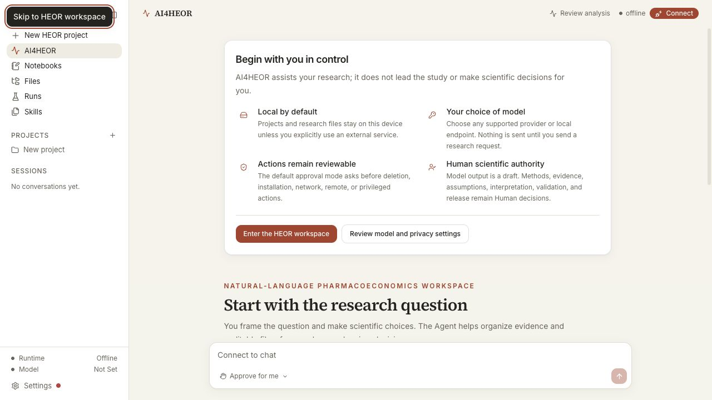
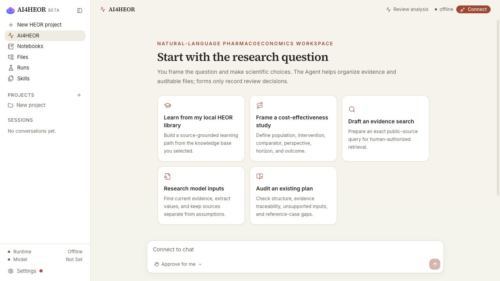
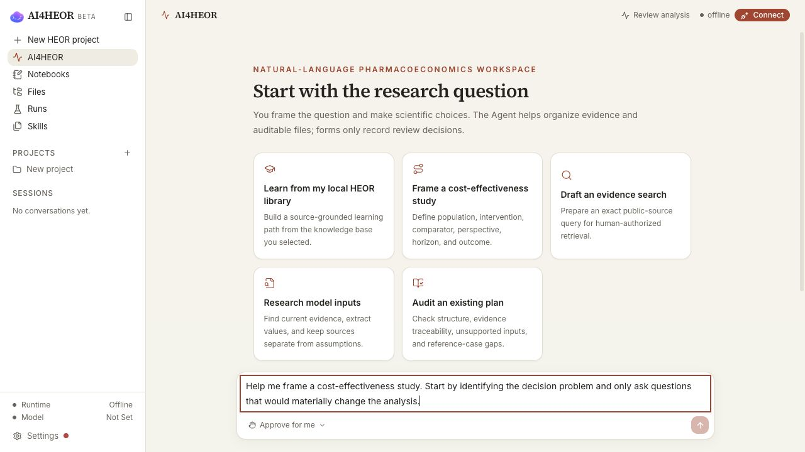

<div align="center">

[](https://github.com/ai4s-research/open-science)

# AI4HEOR

**Local-first, model-agnostic pharmacoeconomics and HEOR workbench for macOS,
Windows & Linux.**

AI4HEOR is developed from the open-source Open Science Desktop platform using
Tauri, MCP, skills, and reproducible artifacts. Natural-language interaction is
primary, while forms only support inspection and Human review. The Human
researcher leads the scientific work; the configured model/runtime assists with
evidence organization, execution, checking, and explanation.

<p>
  <b>English</b> ·
  <a href="./README.zh.md">简体中文</a> ·
  <a href="./README.ja.md">日本語</a> ·
  <a href="./README.es.md">Español</a> ·
  <a href="./README.de.md">Deutsch</a> ·
  <a href="./README.fr.md">Français</a> ·
  <a href="./README.ko.md">한국어</a>
</p>

<p>
  <a href="./LICENSE"></a>
  <a href="https://internscience.github.io/ResearchClawBench-Home/"></a>
  
  
  
  
  <a href="https://discord.gg/fWNMDKcd5P"></a>
  <a href="http://makeapullrequest.com"></a>
  <a href="https://linux.do"></a>
</p>

</div>

---

🎉 **Platform lineage:** The upstream Open Science Desktop project ranks #1 by
scored-task average on [ResearchClawBench](https://internscience.github.io/ResearchClawBench-Home/)
(Pass@1 leaderboard, July 9, 2026). This upstream agent benchmark is not evidence
that AI4HEOR scientific work should be agent-led or that its outputs are valid.

---

## Contents

- [✨ What it does](#what-it-does)
- [🎬 See it in action](#see-it-in-action)
- [🧪 Current capabilities](#current-capabilities)
- [🔌 Skills and connectors](#skills-and-connectors)
- [📦 Install](#install)
- [🚀 Build from source](#build-from-source)
- [🔒 Safety and privacy](#safety-and-privacy)
- [🗂️ Repository layout](#repository-layout)
- [📌 Status](#status)
- [🤝 Contributing](#contributing)
- [📖 Citation](#citation)
- [⚖️ License](#license)

## What it does

**Supports a Human-led HEOR workflow** — from a researcher-defined question to
reviewable evidence, deterministic analysis, validation, and reporting artifacts
in one continuous, auditable session.

- **Natural-language-first assistance** — the researcher initiates and controls the
  work; the model/runtime proposes or executes bounded steps and leaves real,
  inspectable artifacts rather than claiming scientific authority.
- **HEOR projects from the first click** — the app opens in the AI4HEOR workspace;
  new work creates a typed local HEOR project, keeps every project session in the
  HEOR route, and pre-fills a researcher-reviewable intake request without sending it.
- **Local HEOR knowledge bases** — install the dated built-in Chinese pharmacoeconomics
  learning library with one explicit click, or add your own folders. Sources retain their
  hierarchy, are hash-bound and indexed locally, and can ground researcher-initiated
  learning without an automatic network call.
- **Researcher-owned methods currency** — a dated local watchlist records official
  links, revisions, rights status, affected contracts, and revalidation work;
  AI4HEOR flags overdue or unresolved items without scraping restricted content or
  approving scientific choices.
- **Everything traces back** — figures, tables, reports, notebooks, and run outputs
  link to the exact code, inputs, environment, model output, and conversation that
  produced them.
- **Local-first and yours** — sessions, data, provenance, notebooks, and run records
  live in local folders on your machine. Nothing leaves by default.
- **Model-agnostic runtime** — the UI talks through `packages/sdk` to a bundled,
  pinned OpenCode sidecar. Bring your own model; providers, skills, and MCP servers
  stay pluggable.
- **Reproducible by construction** — local, SSH/Slurm, Modal, and notebook-batch runs
  are captured as reproducible run records, not loose terminal scrollback.
- **Extensible** — governed first-party HEOR skills, researcher-managed MCP servers,
  `/` commands, `!` shell mode, and a model-agnostic SDK.

## See it in action

**A Human-led HEOR request -> reviewable, traceable local work.** A new session
starts with pharmacoeconomic study design, HEOR evidence/data analysis,
model/report audit, or a synthetic cost-effectiveness example. The bundled
`examples/heor-cost-effectiveness/` project demonstrates a two-strategy,
three-state cohort workflow. The default HEOR surface installs it only after the
researcher selects the example and keeps the request unsent for review. Its
dependency-free `run_analysis.py` binds the exact script, specification, and CSV
hashes, reproduces `expected/base-case-result.json`, and exposes declared low and
high cost sensitivity values without asking a model to perform the arithmetic.
After a separate Human confirmation, the desktop app can run this exact fixed
case without a configured model, write all three local result files, and add run
and provenance records; no case content is sent to a model provider. Its numbers are
teaching assumptions, not clinical or economic evidence, and it cannot create
approval, cost-effectiveness, or reimbursement conclusions.







## Current capabilities

**Research assistance, as bounded HEOR skills.** AI4HEOR's 45 first-party skills
route researcher-defined tasks without acquiring approval or method-selection
authority. Representative admitted workflows are:

| Skill | Role | Primary output |
| --- | --- | --- |
| `$heor-workbench` | Coordinate researcher-led HEOR work without taking scientific authority | Reviewable local plan, artifacts, and stop points |
| `$heor-local-evidence` | Inventory an explicitly selected local knowledge base without automatic networking | Hash-bound local evidence inventory |
| `$heor-evidence-search` | Draft an auditable PubMed/ClinicalTrials.gov request for Human network authorization | Exact request hash and imported metadata candidates |
| `$heor-model-design` | Structure the Human-defined decision problem and conceptual model | Decision-problem and conceptual-model artifacts |
| `$heor-cohort-state-transition` / `$heor-partitioned-survival` | Execute bounded deterministic economic models | Reproducible costs, QALYs, increments, and checks |
| `$heor-uncertainty-analysis` / `$heor-advanced-value-of-information` | Execute declared uncertainty and bounded VOI workflows | DSA/PSA/CEAC/CEAF/EVPI and separately reviewed advanced VOI |
| `$heor-budget-impact` / `$heor-dynamic-budget-impact` | Execute bounded static or dynamic budget-impact analysis | Disaggregated budget results and audit artifacts |
| `$heor-model-validation` / `$heor-reporting` / `$heor-reproducibility-package` | Validate, report, and package exact current artifacts | Independent-review package, report, and replay bundle |

Every first-party Skill name and description ships in all seven interface
languages while the exact `$skill-id` remains visible. External assets keep
their supplied metadata and remain inactive until separately admitted.

### Platform

| Area | Current state |
| --- | --- |
| Desktop shell | Tauri 2 + React + TypeScript + Vite, with macOS, Windows, and Linux desktop builds. |
| Runtime | Bundled OpenCode sidecar, auto-started by the app, isolated from the user's own OpenCode config/data. |
| Projects and sessions | New work creates a typed local HEOR project with the researcher-led harness; project sessions stay in the AI4HEOR route, while legacy loose sessions remain readable. Multi-session history, `/` commands, and `!` shell mode remain available. |
| Files | Global and per-session file browsing, context menu actions, external open/reveal, copy path, and local preview server. |
| Notebooks | Real `.ipynb` files, Python and R notebook creation, local kernel execution, managed Jupyter environment via bundled `uv`, and an Open JupyterLab action. |
| Runs | Append-only run logs, global SQLite run index, search/facets/pagination, local/remote surfaces, output links, logs, and reproduce prompts. |
| Provenance | `.openscience/provenance.jsonl` tracks file versions and links produced artifacts back to the run or edit that created them. |
| Review | Traceability, statistics-integrity, domain-check, large-file, publication-figure, remote-compute, and Modal run skills are bundled as first-party skills. |
| Viewers | PDF, image, video, HTML, Markdown, code, CSV/TSV tables with charts, DOCX, XLSX, PPTX, molecules, 3D meshes, genome tracks, FITS, DOS/DOSCAR, EIGENVAL bands, qcode, anomaly maps, and phase files. |
| Models | OpenCode provider catalog, OAuth/API-key provider flows, custom OpenAI-compatible endpoints, and local/provider-specific options supported by OpenCode. |
| Interface languages | English, Simplified Chinese, Japanese, Spanish, German, French, and Korean. First-party Skill names and descriptions ship in all seven languages while exact `$skill-id` values remain visible; external Skills retain their supplied metadata. Portuguese (Brazil) and Arabic are registered but not selectable yet. |

## Skills and connectors

Only first-party core skills in `runtime/skills/core/` are bundled by default,
including the AI4HEOR human-authorized PubMed/ClinicalTrials.gov evidence
search, evidence synthesis, model-design, reference-case, uncertainty, advanced
value-of-information, budget-impact, validation, and reporting workflows. Third-party Skills and MCP
servers are governed by a packaged admission registry: discovery candidates are
inactive, and only a compatible, reviewed, cross-platform, hash-locked
`validated-adapter` may enter the app-managed runtime.

The seven `ai4s-research/ai4s-skills` entries are currently quarantined for
adaptation. Anthropic's source-available `docx`, `pdf`, `pptx`, and `xlsx` Skills
are rejected because their per-directory license prohibits copying, derivatives,
and redistribution; AI4HEOR does not fetch or bundle them.

The default connector surface contains no unreviewed third-party one-click MCP
process. Built-in `$heor-evidence-search` performs fixed-endpoint,
Human-authorized PubMed and ClinicalTrials.gov metadata retrieval; Jupyter is
the sole one-click managed local computation tool. Researchers can still add
local or remote MCP servers from Settings, where they are explicitly labelled
as unmanaged external capabilities. Inherited Paper Search MCP and BioMCP
definitions are quarantined candidates, not bundled AI4HEOR defaults. See
[`docs/CONNECT_YOUR_TOOLS.md`](./docs/CONNECT_YOUR_TOOLS.md).

For a neutral positioning note, see
[`Open Science Desktop vs OpenScience`](./docs/open-science-desktop-vs-openscience.md).

## Install

Download the latest installer from the
[Releases page](https://github.com/ai4s-research/open-science/releases/latest).

- **macOS**: `.dmg` / `.app`, Apple Silicon and Intel, macOS 13 Ventura or later.
- **Windows**: NSIS `.exe` and `.msi`, Windows 10/11 x64.
- **Linux**: `.deb` and `.rpm` on x86_64 Linux.

From 0.1.27, a fresh installation uses `~/Documents/AI4HEOR`. When the new root
does not yet exist, AI4HEOR atomically renames the prior default
`~/Documents/OpenScience` root and preserves its contents. If both roots already
exist, it does not merge or delete either one; a base folder explicitly chosen in
Settings always wins.

The currently verified 0.1.35 local x64 macOS artifact is not code-signed or notarized. The
`v*` tag pipeline now fails closed unless both macOS targets receive Developer ID and
Apple notarization credentials and subsequently pass signature, hardened-runtime,
stapled-ticket, and Gatekeeper checks. No credentialed tag run has produced that evidence
yet, and Windows Authenticode signing remains open.

**macOS**: if Gatekeeper says the app is damaged or from an unidentified developer,
install it into Applications and run:

```bash
xattr -cr "/Applications/AI4HEOR.app"
```

**Windows**: if SmartScreen appears, choose **More info -> Run anyway**.

**Linux**:

```bash
sudo apt install ./AI4HEOR_*.deb
# or
sudo rpm -i AI4HEOR-*.rpm
```

## Build from source

Prerequisites:

- Node.js >= 20
- pnpm 9
- Rust toolchain
- macOS, Windows, or Linux system dependencies required by Tauri

```bash
git clone https://github.com/ai4s-research/open-science
cd open-science
pnpm install

# Fetch pinned sidecars and bundled skills. These are git-ignored.
bash scripts/dev/fetch-opencode.sh
bash scripts/dev/fetch-uv.sh

# Run in development or build installers.
pnpm --filter @ai4s/desktop tauri dev
pnpm --filter @ai4s/desktop tauri build

# Linux packages (AppImage is intentionally unsupported).
pnpm --filter @ai4s/desktop tauri build --bundles deb,rpm
```

Useful checks:

```bash
python scripts/dev/test_sidecar_integrity.py -v
pnpm test
pnpm typecheck
pnpm lint
```

## Safety and privacy

- Workspace files, raw data, session history, provenance, notebooks, and run records
  stay local by default.
- Command execution, file deletion, dependency installation, and remote connections
  are human-approved flows in the desktop app.
- Provider credentials are written to app-private runtime config, not to the
  workspace, provenance, git, exports, or global OpenCode config.
- Settings includes a plain-language data-flow view explaining what can be sent to
  the selected model provider.

## Repository layout

| Path | Purpose |
| --- | --- |
| `apps/desktop/` | Tauri + React desktop app. |
| `packages/sdk/` | `OpenCodeClient`; keeps the UI from calling OpenCode directly. |
| `packages/shared/` | Shared domain types and chart palette. |
| `packages/ui/` | Shared UI package. |
| `runtime/skills/core/` | First-party scientific skills. |
| `runtime/skills/external/` | Optional review cache for external candidates; not bundled by default. |
| `runtime/harness/` | Product-owned, researcher-led assistant contract seeded into new projects. |
| `runtime/mcp/` | MCP runtime notes/configuration. |
| `examples/` | Built-in example workspaces. |
| `scripts/dev/` | Sidecar, `uv`, skill fetchers, and focused regression probes. |
| `docs/` | Product, technical, operator, connector, and research notes. |

## Status

The project is a working desktop MVP in active development. The most reliable current
implementation log is [`PROGRESS.md`](./PROGRESS.md). Product and architecture notes
live in [`docs/PRD.md`](./docs/PRD.md) and
[`docs/TECHNICAL_DESIGN.md`](./docs/TECHNICAL_DESIGN.md), but those documents include
target design as well as historical status notes.

Current development is deliberately scoped to running the product through on Intel macOS;
Windows, Linux, Apple-Silicon, and cross-platform release work are paused until that path is
accepted. Current source is 0.1.36; the current verified x64 macOS package remains
0.1.35 while the new Intel package is built and checked. Version 0.1.36 adds the
versioned 25-document Simplified-Chinese pharmacoeconomics learning library and an
explicit local install action. The app verifies the exact packaged manifest and source
hashes, builds the existing project-bound local index without a model or network call,
keeps stable theory/methods separate from dated recent-progress material, and refuses
to overwrite an edited installed copy. It retains the 0.1.35 separately confirmed,
model-free local run for the hash-bound cost-effectiveness teaching case, the 0.1.34
sixth HEOR starter, the 0.1.33 rewrite of the Simplified-Chinese research surface,
and all 45 bundled Skill
descriptions in direct pharmacoeconomics language, and moves previously hard-coded
download, file-manager, Jupyter, notebook, and generated-assistant prompts into the seven
shipped locale resources. It retains the 0.1.32 fail-closed new-project harness and its
machine-readable Human scientific-authority contract. The 80,139,562-byte
AI4HEOR 0.1.35 x64 macOS DMG has SHA-256
`11d1e4eb8924d1834003a78042b78e4befdce4b25ee2ecc1ca0253e449654003` and was locally built
from clean tracked source commit `ad9f139975cef9be943cb23b702fd79bdcfe0592`. All 286
configured resources match source bytes, all 177 deterministic HEOR tests pass
against the mounted core, and isolated first-launch and legacy-migration checks prove fresh
`Documents/AI4HEOR` creation plus content-preserving `Documents/OpenScience` migration.
An additional isolated native UI run completed the model-free base case and two declared
sensitivity calculations, created one successful Run and three Provenance entries, and
rejected a subsequently changed governed input without altering any result bytes.
The default entry creates a typed HEOR project and prepares a localized, unsent
natural-language research intake. A seven-language first-use guide explains local storage,
model choice, approval boundaries, and Human scientific authority without collecting a
scientific form or hiding the research conversation. The research surface describes the
engine as the AI assistant; the OpenCode implementation name and local endpoint are visible
only in Settings → Advanced diagnostics. The default Settings surface contains governed
first-party HEOR evidence access, managed Jupyter, and explicitly unmanaged user-added
MCP servers; it no longer provisions the inherited generic Open Science connector catalog.
The current 0.1.31 Apple Silicon DMG was separately cross-built from clean commit
`2834785e057ac54477a9633f07390bc173251644` on an Intel Mac. Its 76,095,510 bytes have
SHA-256 `86b0583e36480affb90ec08b84d8c4276ec702b92e69ef90894f58c2888da42e`;
read-only inspection proved
pure-arm64 main/OpenCode/uv payloads, all 282 configured resources byte-identical to
source, and all 177 deterministic HEOR tests against the mounted core. That is bounded
cross-host package evidence, not native Apple Silicon execution: the strict verifier
correctly stops when the Intel host cannot execute the arm64 sidecar, so no formal arm64
release-evidence JSON or first-start claim was produced. The package is also not
Developer-ID signed or notarized: it has only an ad-hoc linker signature, no Team ID,
sealed resources, or stapled ticket, and is rejected by strict codesign and Gatekeeper.
The tag-only release path now requires all Apple credential names before building and
will record macOS release evidence only after every nested Mach-O shares one Developer ID
whose Team ID matches the notarization account,
hardened runtime and secure timestamps are present, resources are sealed, no executable
enables `get-task-allow`, the notarization ticket is stapled, and Gatekeeper reports
`Notarized Developer ID`. Manual workflow previews remain explicitly unsigned and cannot
silently acquire those claims. Tagged matrix jobs no longer create or populate a release;
only the final job may create a draft after all four evidence files and the cross-platform
manifest validate, and it uploads exactly those verified installers and records. This gate
is locally contract-tested and rejects the
current unsigned 0.1.35 x64 DMG, but it has not been exercised with real Apple credentials.
The AI4HEOR 0.1.30 Linux `.deb` and `.rpm` were built from the same clean commit
`0beb7b2bcb04a796f256bd8f8528bb787aa77319`. Both packages are payload-verified with all
282 configured resources matching source bytes and all 177 deterministic HEOR tests
passing independently from each extracted package. The `.deb` passes a brand-new Ubuntu
22.04 non-root headless first start with a fresh `Documents/AI4HEOR`; the `.rpm` passes a
Fedora 42 headless start that preserves an exact marker while migrating the legacy
`Documents/OpenScience` root. Each run observed exactly one desktop process and one bundled
OpenCode child. A real visual Linux desktop-session acceptance remains outstanding.

## Contributing

Issues and PRs are welcome. Keep changes minimal and verifiable, follow
[`AGENTS.md`](./AGENTS.md), and run the checks before opening a PR. For discussion,
join the [Open Science Discord](https://discord.gg/fWNMDKcd5P) or the
[linux.do](https://linux.do) community.

## Citation

If you use AI4HEOR in your research, please cite it:

```bibtex
@software{ai4heor,
  author  = {{The AI4HEOR Contributors}},
  title   = {AI4HEOR: a local-first, model-agnostic AI workbench for pharmacoeconomics and HEOR},
  year    = {2026},
  version = {0.1.36},
  url     = {https://github.com/ai4s-research/open-science},
  license = {MIT}
}
```

GitHub's **"Cite this repository"** button (top of the repo page, generated from
[`CITATION.cff`](./CITATION.cff)) provides the same reference in APA and BibTeX.

## License

[MIT](./LICENSE). Bundled third-party skills and connectors keep their own licenses.

> AI4HEOR is beta research tooling. Human researchers lead the science and remain
> accountable for methods and decisions; verify numbers, citations, code, and conclusions.
