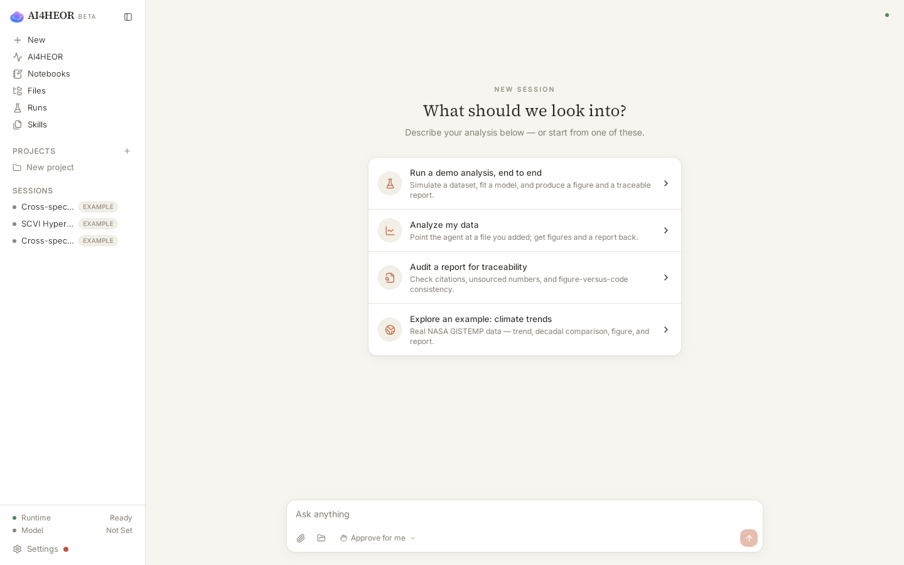
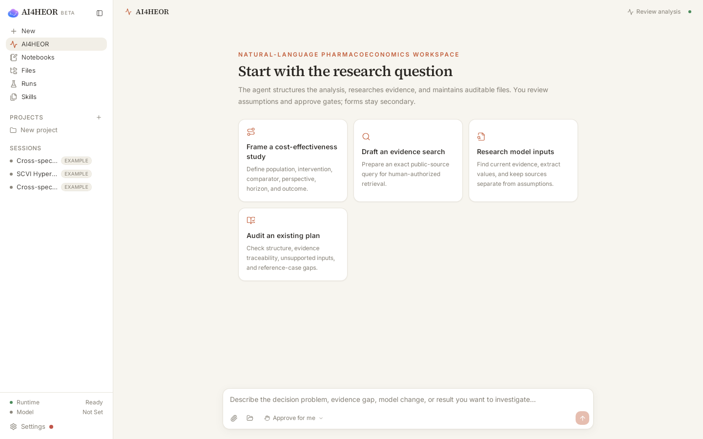
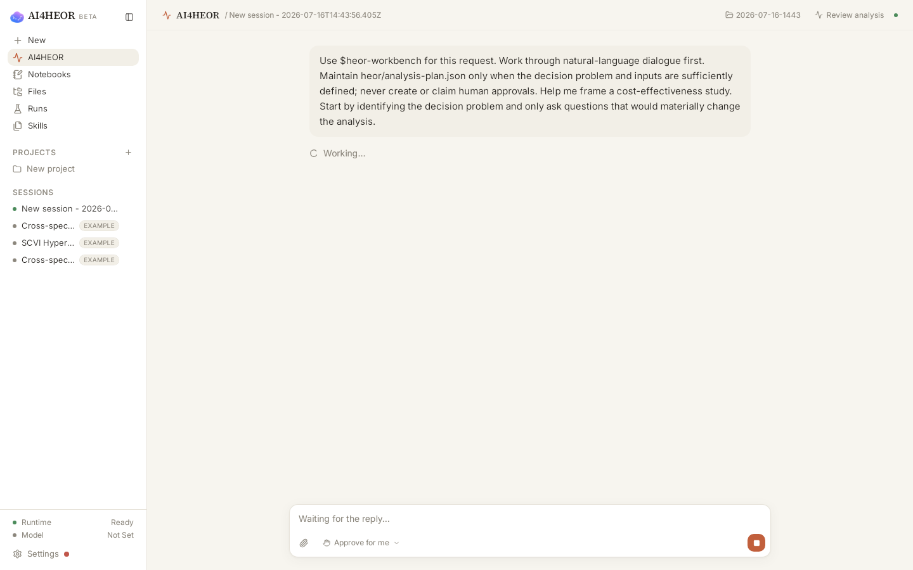
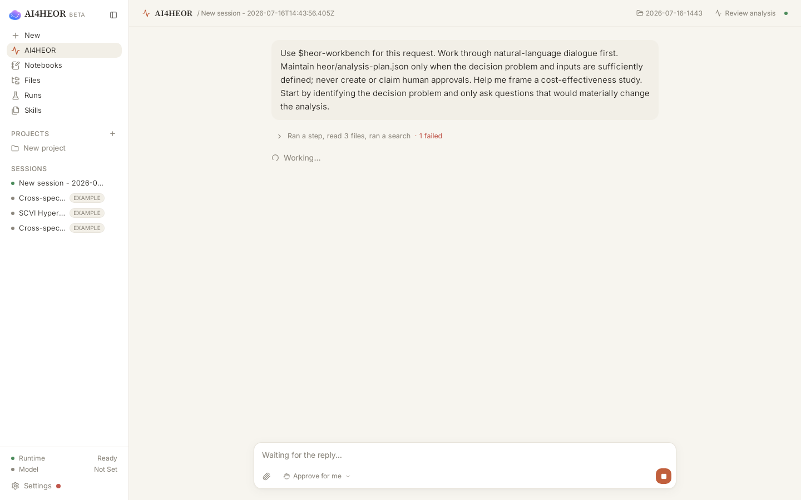
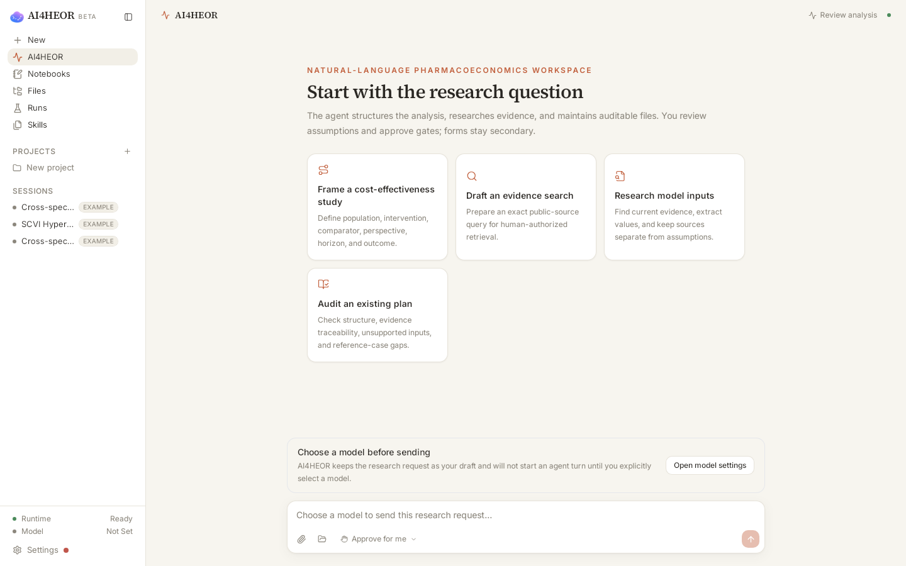
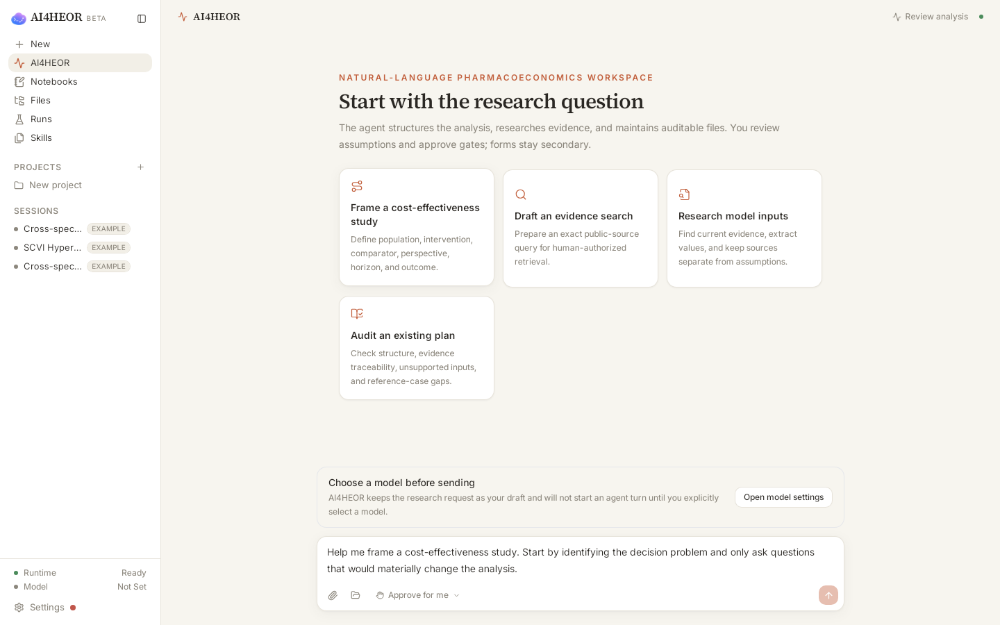
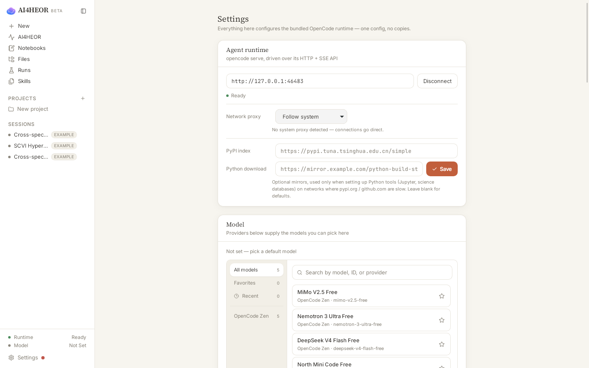

# Linux packaged-app visual audit

- Date: 2026-07-16
- Environment: Ubuntu 22.04 container, WebKitGTK 2.50.4, Xvfb 1600 × 1000, Openbox, AI4HEOR window 1440 × 900
- Scope: packaged Linux WebKit rendering of first launch, AI4HEOR entry, starter behavior, explicit-model gate, and model-settings handoff

This is container-rendered Linux visual evidence. It is not evidence from a physical Linux desktop, does not cover Windows or macOS, and is not a complete keyboard, screen-reader, contrast, or scientific-validity assessment.

## Artifact boundary

- Screenshots 01–04 use the previously verified release package `AI4HEOR_0.1.18_amd64.deb`, SHA-256 `6c418b91438e9af32fd105de412dfd0047eaa7e215f48fffb2b11a814c28bde7`.
- Screenshots 05–07 use an isolated, temporary `.deb` built from the source fix in this milestone, SHA-256 `684be4e38d42933a41794ab6a72ab6c4d92bf18c6ac31da9a557e0205e61e39d`. It exists only to validate the fix and is not a replacement release artifact.
- Every screenshot below was opened and visually inspected at its original 1440 × 900 resolution. Blank, loading-only, and wrong-window captures were not accepted.

## Flow evidence

1. **First launch — healthy.** The actual packaged window opens at the natural-language session surface. Runtime state is visible, the model is truthfully shown as not set, and AI4HEOR is a first-level destination.

   

2. **AI4HEOR entry — healthy.** The page leads with the research question, states that the agent assists with structure and evidence, assigns assumptions and gates to the Human, and keeps forms secondary.

   

3. **Original starter behavior — unhealthy.** Clicking the cost-effectiveness starter immediately created a session and sent an internal constrained prompt. The Human had no opportunity to review or edit the suggested research request first.

   

4. **Original no-model state — unhealthy.** With `Model Not Set`, the turn entered `Working…`, executed local steps, exposed a failed-step summary, and did not give the user an immediate model-configuration recovery path. This was the root UX defect found by the audit.

   

5. **Explicit-model gate after the fix — healthy.** AI4HEOR now explains that no agent turn starts until the Human explicitly selects a model. The send action is disabled, and a visible model-settings action is provided without displacing the natural-language entry.

   

6. **Human-reviewed draft after the fix — healthy.** Clicking the same starter populates the natural-language composer instead of creating a session or starting the agent. The complete request remains editable while send stays disabled until a model is selected.

   

7. **Model-settings handoff — healthy.** The recovery action reaches the existing Settings page with the `Model` section visible above the fold and the default model still truthfully reported as not set. No provider is selected automatically.

   

## Result

The audit found and closed one high-impact Human-control defect: AI4HEOR starters no longer initiate research work on click, and AI-assisted turns now require an explicit model choice. The natural-language composer remains the primary work surface; the starter cards only help draft language, while model selection and later review forms remain bounded auxiliary controls.

Automated verification for the source fix: 3 targeted AI4HEOR route tests, 548 frontend tests across 82 files, TypeScript typecheck, ESLint, and the isolated Linux production/package build passed. Existing React `act(...)`, React Router future-flag, jsdom canvas, `3Dmol` eval, and large-chunk warnings remain unrelated and non-blocking.

Remaining evidence gaps: real Linux hardware/window-manager behavior, screen-reader output, complete keyboard traversal, measured contrast, configured-provider response behavior, Windows visual first launch, signed installers, authenticated Human identity, and scientific validity.
